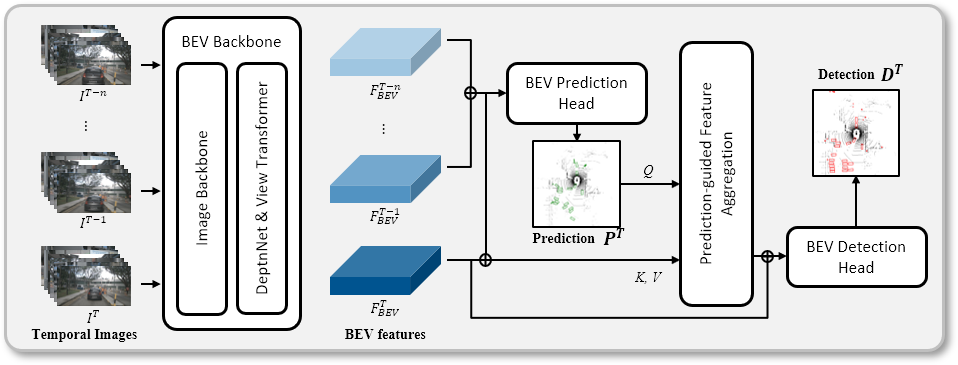

# P2D

Predict to Detect: Prediction-guided 3D Object Detection using Sequential Images, ICCV 2023 ([Paper](https://openaccess.thecvf.com/content/ICCV2023/papers/Kim_Predict_to_Detect_Prediction-guided_3D_Object_Detection_using_Sequential_Images_ICCV_2023_paper.pdf), [Supplementary](https://openaccess.thecvf.com/content/ICCV2023/supplemental/Kim_Predict_to_Detect_ICCV_2023_supplemental.pdf))



# Getting Started
- [Installation](docs/install.md)
- [Data preparation](docs/data_preparation.md)
- [Run](docs/run.md)


# Model Zoo
|Model | Backbone | Weight| mAP | NDS|
| - | - | - | -| -|
| P2D| ResNet50 |[link](https://drive.google.com/file/d/1Cj6Dwvs6hS6iUKhZEpPfScs8t7Eh4_9G/view?usp=sharing) | 36.0 | 47.4 |
| P2D| ConvNext-B | [link](https://drive.google.com/file/d/1r_dCbGEQX4HmABag8EuET6J1hnUMIONX/view?usp=sharing) | 46.0 | 55.1 |
# Citation
```
@inproceedings{kim2023predict,
  title={Predict to Detect: Prediction-guided 3D Object Detection using Sequential Images},
  author={Sanmin Kim, Youngseok Kim, In-Jae Lee, and Dongsuk Kum},
  booktitle={Proceedings of the IEEE/CVF International Conference on Computer Vision},
  pages={18057--18066},
  year={2023}
}
```
# Acknowledgement
- [BEVDepth](https://github.com/Megvii-BaseDetection/BEVDepth)
- [mmdet3d](https://github.com/open-mmlab/mmdetection3d)
- [Deformable-DETR](https://github.com/fundamentalvision/Deformable-DETR)
